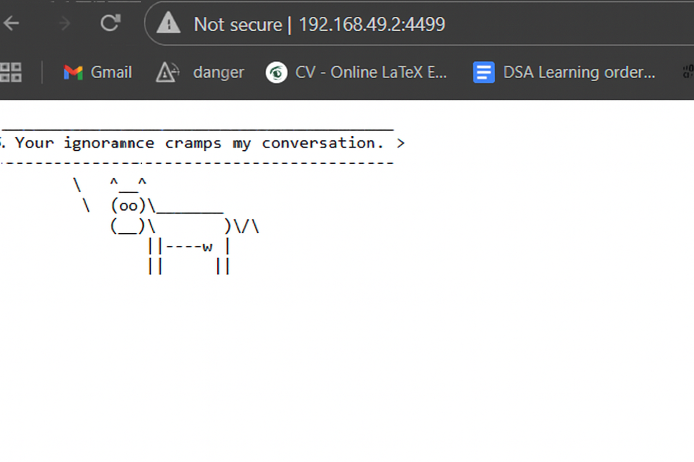

<<<<<<< HEAD
# 🩺 Linux System Health Monitor (Bash)

A lightweight Bash script to monitor CPU usage, memory consumption, disk space, and running processes on a Linux system. Alerts are logged to the console and a log file when thresholds are exceeded.

## 📦 Features

- ✅ CPU usage monitoring
- ✅ Memory usage tracking
- ✅ Disk space checks
- ✅ Process count alerts
- ✅ Console + log file alerts
- ✅ Cron-ready for automation

## 🚀 Getting Started
./health_monitor.sh


=======
# Cow wisdom web server

## Prerequisites

```
sudo apt install fortune-mod cowsay -y
```

## How to use?

1. Run `./wisecow.sh`
2. Point the browser to server port (default 4499)

## 📜 What is wisecow?

**wisecow** is a whimsical microservice that serves random fortunes wrapped in a cowsay bubble — all over HTTP. It’s a fun, containerized project that demonstrates:

- 🐳 Docker image creation with runtime dependencies
- ☸️ Kubernetes deployment with Ingress routing
- 🧪 Shell scripting for lightweight HTTP servers
- 🧱 DevOps best practices for local development and testing

---

## 🚀 Quickstart (Minikube)
minikube start --driver=docker
minikube addons enable ingress

Point Docker to Minikube
eval $(minikube docker-env)

Build the Docker image
docker build -t wisecow:founderfix .

Deploy to Kubernetes
kubectl apply -f k8s/deployment.yaml
kubectl apply -f k8s/service.yaml
kubectl apply -f k8s/ingress.yaml

What to expect?


🧱 Project Structure
wisecow-k8s-deployment/
├── Dockerfile              # Builds the cowsay server image
├── wisecow/
│   └── wisecow.sh          # Bash-based HTTP server with cowsay + fortune
├── k8s/
│   ├── deployment.yaml     # Kubernetes Deployment
│   ├── service.yaml        # ClusterIP Service

│   └── ingress.yaml        # Ingress for domain-style routing
>>>>>>> 3571ecb985c56640c744f768abcdcd8b24542115
